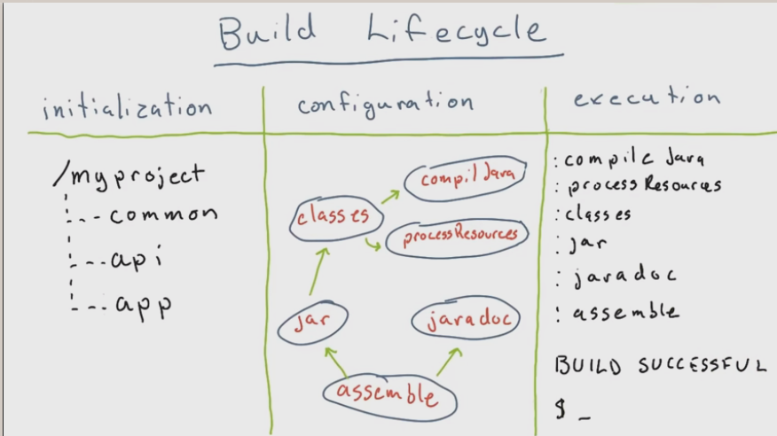

# Links

[learn X in Y groovy](http://learnxinyminutes.com/docs/groovy/)  
[Groovy docs](http://www.groovy-lang.org/documentation.html)  
[gradle tasks](    https://docs.gradle.org/current/userguide/more_about_tasks.html)  
[Gradle DSL reference](https://docs.gradle.org/current/dsl/)  

- 1.05-Exercise-ExperimentWithGroovy
The build.gradle should not start with "Welcome to the solutions"

- 1.08-Demo-TaskDependencies
gradle tasks doesn't show any tasks...

- 1.10-Demo-InteractingWithTheFileSystem
No solutions.gradle

- 20. Quiz: Docs Scavenger Hunt
Could not find only if

- 23. Incremental Builds
```javascript
gradle bundleSources --info  
```
[Introducing Incremental Build Support](https://blog.gradle.org/introducing-incremental-build-support)  

- 25. Parameterising Your Build  
`CLI` - **C**ommand **LI**ne arguments  
`ext` - project.**ext** (for "extra properties")  
[.properties wiki](https://en.wikipedia.org/wiki/.properties)  
[Build Environment](https://docs.gradle.org/current/userguide/build_environment.html)


- 27. Creating Custom Task Types  
[chapter 58 of the Gradle user guide](https://docs.gradle.org/current/userguide/custom_tasks.html)  


- 29. Troubleshooting and Logging  
`Error` - Error   
`-q` or `--quiet` - QUIET and higher  
`-w` or `--warn`- WARN and higher  
`lifecycle` - default  
`-i` or `--info` - INFO and higher  
`-d` or `--debug` - DEBUG and higher (that is, all log messages)  
</br>Command line optinos:  
`-s` or `--stacktrace`  
`-S` or `--full-stacktrace`  
</br>[Gradle User Guide chapter on logging](https://docs.gradle.org/current/userguide/logging.html)  

- 32 Explore the Build Lifecycle  
[build lifecycle](https://docs.gradle.org/current/userguide/build_lifecycle.html)  
  
